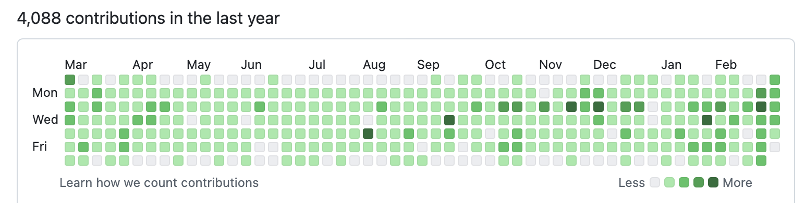

# AutoContributeBot
> 使用定时任务执行脚本，刷github的contributions，不至于一片白。



## 使用教程
- 新建.env文件，参考模板.env.example
- [创建access token](https://github.com/settings/personal-access-tokens)
- access token 给对应的仓库权限，建议使用私有仓库
- 30 11 * * * python3 main.py > /dev/null 2>&1 # 每天11点半执行代码

```
# .env.example
GITHUB_TOKEN="github access token" # 个人访问令牌
USERNAME="github username" # github用户名
REPO="repo" # 仓库名
RANGE="0-6" # 0-6随机取值当push次数
```

### cron
```plain
┌───────────── 分钟 (0 - 59)
│ ┌───────────── 小时 (0 - 23)
│ │ ┌───────────── 日 (1 - 31)
│ │ │ ┌───────────── 月 (1 - 12 或 JAN-DEC)
│ │ │ │ ┌───────────── 星期 (0 - 6 或 SUN-SAT)
│ │ │ │ │
│ │ │ │ │
│ │ │ │ │
* * * * *
```

|符号|描述|举例|
|:-------|:-----|:-------|
|*|任意值|* * * * * 每天每小时每分钟|
|,|值分隔符|1,3,4,7 * * * * 每小时的 1 3 4 7 分钟
|-|范围|1-6 * * * * 每小时的 1-6 分钟|
|/|每|*/15 * * * * 每隔 15 分钟|
